# DannFlow Command Help

This is a report-only command. After this command file has been loaded, do not inspect additional files, run shell commands, call MCP tools, edit code, update docs, move tasks, stage changes, commit, or create issues. Only reply in chat with the curated command catalog below.

## Output format

Reply with exactly these sections, in this order:

1. `# DannFlow Command Help`
2. `## How to Run Commands`
3. `## Command Categories`
4. `## Command Graph`
5. `## Notes`

Keep the response concise. Do not add implementation plans, recommendations, status updates, or next steps.

## Content to return

# DannFlow Command Help

## How to Run Commands

Claude Code:

```text
/help-dannflow
/ask-command <plain-English intent>
/<command-name> [arguments]
```

Codex:

```text
/claude-command help-dannflow
/ask-claude-command <plain-English intent>
/claude-command <command-name> [arguments]
```

Codex uses `.codex/commands/claude-command.md` as a bridge. The source-of-truth command prompts stay in `.claude/commands/`.

## Command Categories

### Help & Routing

| Command | Says |
|---|---|
| `/help-dannflow` | Shows this categorized command catalog and graph. Report-only. |
| `/ask-command <intent>` | Chooses the best Claude command for a plain-English task. |
| `/claude-flow-help` | Shows Claude-Flow/Ruflo orchestration command help. |

### Project Setup

| Command | Says |
|---|---|
| `/new-project ["name"]` | Starts a new DannFlow project from the starter. |
| `/masterplan-init` | Links an existing Kanban-style GitHub Project and creates detailed Phase 0 cards for an initialized SaaS. |
| `/setup-supabase` | Guides the existing template's Supabase environment values and dashboard settings without changing schema. |
| `/setup-auth` | Configures the existing template's email auth, Google sign-in, redirects, and branded emails without changing schema. |
| `/business-init` | Captures business/project context. |
| `/init-claude` | Refreshes Claude project context, skills, and command docs. |
| `/init-update` | Updates the local DannFlow command/runtime setup. |
| `/adopt-dannflow [--no-protect\|--force]` | Adopts an existing repo into DannFlow conventions. |

### Planning & Task Tracking

| Command | Says |
|---|---|
| `/make-masterplan <phase> [--project-url <url>]` | Expands a later phase and syncs its ordered task cards. |
| `/update-masterplan [--project-url <url>]` | Syncs `MASTERPLAN.md` changes to GitHub Project cards. |
| `/what-task [--project-url <url>]` | Shows current task status, explains why the chosen task matters, and keeps the next backlog task Ready. |
| `/masterplan-task <task>` | Executes one ordered `MASTERPLAN.md` task. |
| `/verify-task [task-id]` | Produces the human verification checklist for an active task. |
| `/close-task [task-id]` | Closes a verified task, records a short test note, and moves project tracking to done. |

### Build & UI

| Command | Says |
|---|---|
| `/new-feature <name>` | Scaffolds a feature with service, types, page, and form patterns. |
| `/new-page <route>` | Scaffolds a Next.js App Router page. |
| `/design-project ["section"]` | Proposes an approved project-specific theme, then adapts the existing template in place. |
| `/ui [target]` | Rewrites UI for responsiveness, accessibility, and semantic tokens. |

### Database & Supabase

| Command | Says |
|---|---|
| `/migrate <description>` | Runs the tracked Drizzle migration workflow. |
| `/schema-change <description>` | Runs the explicit live Supabase MCP schema-change workflow. |
| `/checkpoint` | Snapshots the live Supabase schema. |
| `/start-supabase [project ref\|name] [--pause <project ref>]` | Starts or restores a paused Supabase project and handles free-plan active-project limits. |
| `/pause-supabase [project id\|name]` | Pauses a Supabase project after listing, confirming, and verifying the target. |
| `/sync-types` | Regenerates `src/types/supabase.ts`. |
| `/explain-schema` | Explains the live Supabase schema. |
| `/rls <table>` | Explains RLS policies for one table. |
| `/seed <table\|all>` | Generates type-safe seed data. |

### Security & Quality

| Command | Says |
|---|---|
| `/review` | Runs a pre-PR quality review. |
| `/security-audit` | Audits security risks and guardrail violations. |
| `/rls-check` | Checks service-layer Supabase queries for ownership filters. |
| `/cleanup` | Reports dead code, unused exports, and stale files. |
| `/no-conflict` | Reports conflicts between docs and actual code. |

### SEO & Marketing

| Command | Says |
|---|---|
| `/seo-check [route]` | Reports SEO gaps for a route. |
| `/seo-fix <route\|all>` | Fixes missing SEO essentials after confirmation. |
| `/marketing-check [route]` | Reports conversion and messaging gaps. |

### GitHub & Release

| Command | Says |
|---|---|
| `/commit` | Stages changes and drafts a conventional commit message. |
| `/sync-upstream [path\|--commits N]` | Pulls selected upstream DannFlow updates into the project. |
| `/sync-to-upstream [path\|--dry-run]` | Prepares local generic improvements for upstream contribution. |
| `/github/*` | Advanced GitHub workflows: PRs, issues, releases, repo analysis, project sync. |

### Documentation & Command Maintenance

| Command | Says |
|---|---|
| `/make-command <description>` | Creates a new custom command. |
| `/sync-commands` | Audits command docs against command files. |
| `/auto-docs [--fix]` | Audits broader project docs, scripts, env vars, skills, and commands. |

### Advanced Orchestration

| Command | Says |
|---|---|
| `/claude-flow-swarm <task>` | Runs Claude-Flow swarm orchestration. |
| `/claude-flow-memory <operation>` | Uses Claude-Flow memory operations. |
| `/agents/*` | Agent lifecycle commands: spawn, list, status, logs, health, metrics, pool. |
| `/swarm/*` | Swarm setup, research, development, testing, monitoring, and strategy commands. |
| `/sparc/*` | SPARC modes: spec, architect, code, debug, test, review, optimize, document. |
| `/hive-mind/*` | Hive-mind sessions, consensus, memory, metrics, spawn, resume, stop. |
| `/coordination/*` | Task orchestration, agent spawn, and swarm initialization commands. |
| `/automation/*` | Smart agents, auto-agent, self-healing, session memory, workflow selection. |
| `/hooks/*` | Hook setup and lifecycle prompts. |
| `/monitoring/*` | Agent metrics, status, real-time views, and swarm monitoring. |
| `/analysis/*` | Performance and token analysis reports. |
| `/memory/*` | Memory usage, search, persistence, and neural memory commands. |
| `/optimization/*` | Parallel execution, topology, and cache optimization commands. |
| `/workflows/*` | Workflow creation, execution, export, development, and research commands. |

## Command Graph

```mermaid
graph TD
  Help["Help & Routing"] --> DH["/help-dannflow"]
  Help --> AC["/ask-command"]
  Help --> CCH["/claude-flow-help"]

  Codex["Codex Bridge"] --> CC["/claude-command <command> [args]"]
  Codex --> ACC["/ask-claude-command <intent>"]
  CC --> ClaudeCommands[".claude/commands/*"]
  ACC --> ClaudeCommands

  Setup["Project Setup"] --> NP["/new-project"]
  NP --> MPI["Create Kanban Project → /masterplan-init"]
  Setup --> BI["/business-init"]
  Setup --> IC["/init-claude"]
  Setup --> IU["/init-update"]
  Setup --> AD["/adopt-dannflow"]

  Planning["Planning & Tasks"] --> MPI
  Planning --> MM["/make-masterplan <phase>"]
  Planning --> UM["/update-masterplan"]
  Planning --> WT["/what-task"]
  Planning --> MT["/masterplan-task"]
  Planning --> VT["/verify-task"]
  Planning --> CT["/close-task"]

  Build["Build & UI"] --> NF["/new-feature"]
  Build --> NPG["/new-page"]
  Build --> DP["/design-project"]
  Build --> UI["/ui"]

  DB["Database & Supabase"] --> MIG["/migrate"]
  DB --> SC["/schema-change"]
  DB --> CP["/checkpoint"]
  DB --> SS["/start-supabase"]
  DB --> PS["/pause-supabase"]
  DB --> ST["/sync-types"]
  DB --> ES["/explain-schema"]
  DB --> RLS["/rls"]
  DB --> Seed["/seed"]

  Quality["Security & Quality"] --> Review["/review"]
  Quality --> SA["/security-audit"]
  Quality --> RC["/rls-check"]
  Quality --> CL["/cleanup"]
  Quality --> NC["/no-conflict"]

  Growth["SEO & Marketing"] --> SEOCheck["/seo-check"]
  Growth --> SEOFix["/seo-fix"]
  Growth --> MC["/marketing-check"]

  Maint["Docs & Maintenance"] --> MKC["/make-command"]
  Maint --> SYC["/sync-commands"]
  Maint --> ADOC["/auto-docs"]
  Maint --> COM["/commit"]
  Maint --> SU["/sync-upstream"]
  Maint --> STU["/sync-to-upstream"]

  Advanced["Advanced Orchestration"] --> Agents["/agents/*"]
  Advanced --> Swarm["/swarm/*"]
  Advanced --> SPARC["/sparc/*"]
  Advanced --> Hive["/hive-mind/*"]
  Advanced --> Coord["/coordination/*"]
  Advanced --> Auto["/automation/*"]
  Advanced --> Hooks["/hooks/*"]
  Advanced --> Monitor["/monitoring/*"]
  Advanced --> Analysis["/analysis/*"]
  Advanced --> Memory["/memory/*"]
  Advanced --> Opt["/optimization/*"]
  Advanced --> Workflows["/workflows/*"]
```



## Notes

- `/help-dannflow`, `/ask-command`, `/seo-check`, `/marketing-check`, `/cleanup`, `/no-conflict`, and `/claude-flow-help` are report-only by design.
- Active rewrite commands say so in their own command prompt and should follow the project guardrails.
- Codex should use `/claude-command <command> [args]` to run Claude commands through the bridge.
