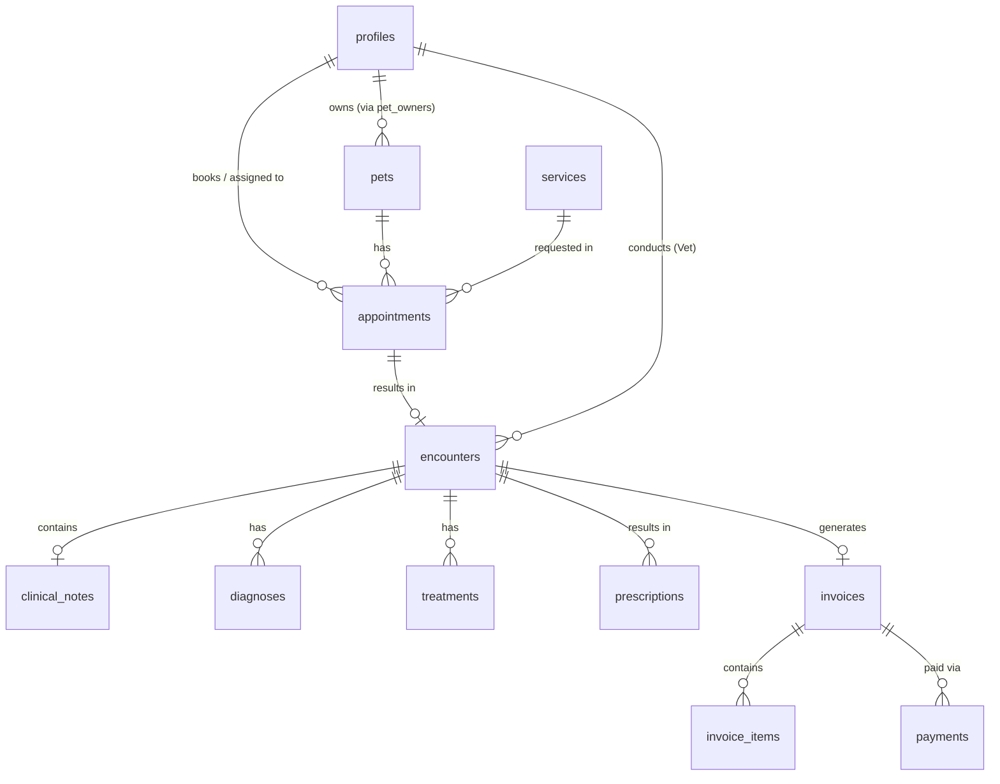

# E-VetDoc Database Schema Documentation

This document outlines the core PostgreSQL schema and relationships for the E-VetDoc system. The database is managed via Supabase and uses Row Level Security (RLS) for data protection.

## Entity Relationship Overview

## Core Tables

### 1. `profiles`
The central user table mapping to Supabase Auth.
- **Roles:** `admin`, `veterinarian`, `owner`
- **Purpose:** Stores user information, contact details, and determines access levels.

### 2. `pets` & `pet_owners`
- **`pets`:** Stores the animal's profile (name, species, breed, age, sex).
- **`pet_owners`:** A junction table linking `pets` to `profiles`. A pet can have multiple owners/caretakers, but one is usually the primary contact.

### 3. `services`
- **Purpose:** A catalog of clinic offerings (consultations, vaccinations, grooming).
- **Details:** Stores pricing, duration, and whether the service is featured/published on the public booking page.

### 4. `appointments`
- **Purpose:** The core scheduling entity.
- **Relationships:** Links a `pet`, an `owner` (profile), a `service`, and an `assigned_veterinarian` (profile).
- **Lifecycle:** Tracks statuses (`requested`, `scheduled`, `confirmed`, `completed`, `cancelled`, etc.) and the history of those changes in `appointment_status_history`.

### 5. `encounters` (Clinical Records)
- **Purpose:** Represents the actual medical visit. It is usually created when an appointment is marked as `diagnosed` or `completed`.
- **Relationships:** Links to `appointments`, `pets`, and the `veterinarian` who conducted the visit.
- **Child Records:**
  - **`clinical_notes`:** Uses the SOAP (Subjective, Objective, Assessment, Plan) format.
  - **`diagnoses`:** Medical conditions diagnosed during the visit.
  - **`treatments`:** Procedures performed during the visit.
  - **`prescriptions`:** Medications prescribed.

### 6. `invoices` & `payments`
- **Purpose:** Billing management for the clinic.
- **`invoices`:** Generated from an `encounter` and billed to an `owner`. Tracks VAT, discounts, and total amounts.
- **`invoice_items`:** The line items on the invoice (e.g., consultation fee, medicine cost).
- **`payments`:** Tracks payments made against an invoice (cash, GCash, card, bank transfer).

## Row Level Security (RLS)

The system relies heavily on Supabase RLS. By default:
- **Owners (Clients):** Can only read and update their own `profile`, view their own `pets`, `appointments`, and `invoices`.
- **Veterinarians:** Can read all `pets` and `appointments`. Can create and edit `encounters` and `clinical_notes`.
- **Admins:** Have full read/write access to manage `services`, `invoices`, and `staff_audit_logs`.

*All database queries from the frontend should assume RLS is active and will automatically filter data based on the authenticated user's JWT.*
