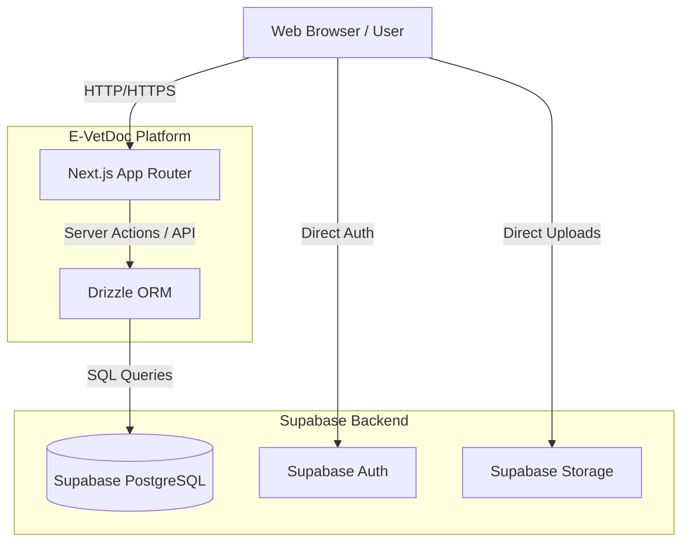

# E-VetDoc System Architecture & Flow

This document provides a high-level overview of the E-VetDoc system architecture and the standard operational flow, designed for incoming developers and thesis researchers.

## Technology Stack

- **Frontend / Framework:** Next.js 14+ (App Router), React, Tailwind CSS, Shadcn UI
- **Backend / Database:** Supabase (PostgreSQL), Supabase Auth, Supabase Storage
- **ORM / Querying:** Drizzle ORM (strictly for querying, *not* for migrations)
- **Migrations:** Native Supabase CLI (`supabase/migrations/`)

## High-Level Architecture

## Core Application Flows

### 1. User Onboarding & Auth Flow
1. User signs up via the public portal (Email/Password or OAuth).
2. Supabase Auth creates a user record.
3. A Postgres Database Trigger (`handle_new_user`) automatically intercepts this event and creates a matching row in the `profiles` table with the default role of `owner`.

### 2. Appointment Booking Flow (Owner)
1. Owner logs in and navigates to the booking page.
2. Owner selects a `service`, their `pet`, and a preferred date/time.
3. The system creates an `appointment` record with the status `requested`.
4. The clinic admin/staff reviews the request and updates the status to `scheduled`, assigning a `veterinarian`.

### 3. Clinical Encounter Flow (Veterinarian)
1. The assigned Veterinarian opens the scheduled appointment.
2. The Vet conducts the checkup and creates an `encounter` record.
3. The Vet fills out `clinical_notes` (SOAP format), adds `diagnoses`, `treatments`, and `prescriptions`.
4. The Vet signs the encounter (status changes to `signed`).
5. The appointment status is updated to `diagnosed` or `completed`.

### 4. Billing & Payment Flow (Admin/Staff)
1. Once an encounter is completed, the system or staff generates an `invoice`.
2. The `invoice_items` are populated based on the `treatments` and `services` rendered during the encounter.
3. The Owner is notified of the pending invoice.
4. The Owner pays (via cash, GCash, etc.), and the staff records a `payment`.
5. The invoice status updates to `paid` once the balance is zero.

## Developer Guidelines

- **Schema Changes:** Never edit the live database directly. Use local Supabase Studio (`pnpm db:setup`), capture changes using `pnpm db:generate <name>`, and push to remote using `pnpm db:migrate`.
- **Data Access:** Do not write raw SQL strings in the app. Use Drizzle ORM inside the `src/services/` directory.
- **Security:** Do not implement authorization logic in the UI components. Rely on Supabase Row Level Security (RLS) policies defined in the database migrations to protect data.
